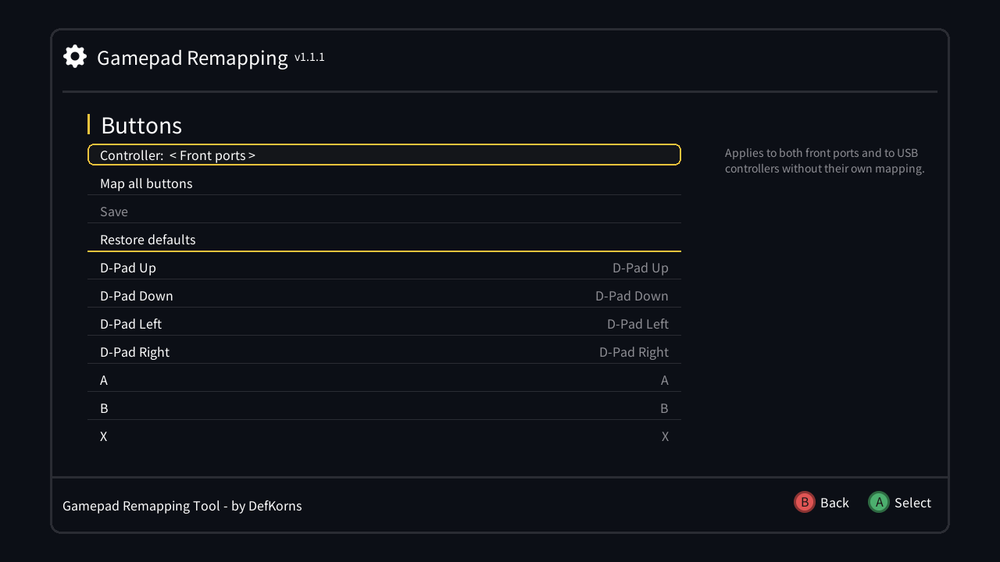
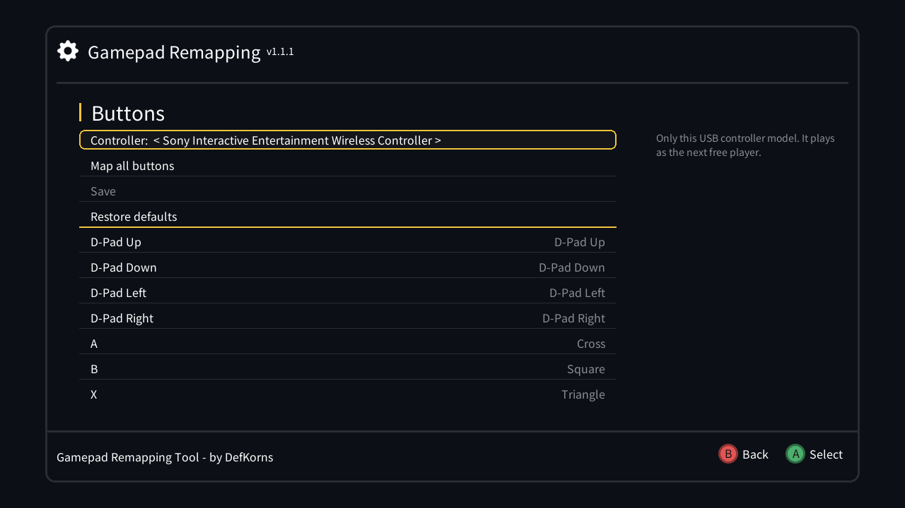

# Options Menu - Gamepad Remapping Tool

[](https://github.com/DefKorns/om-gamepad-remapping-tool/actions/workflows/build.yml)
[](LICENSE)

**Requires [my Options Menu fork](https://github.com/DefKorns/OptionsMenu/releases) as a base — not compatible with any other UI.**

| Front ports | A USB controller |
| --- | --- |
|  |  |

## What is it?

Remap the buttons that Canoe and Kachikachi (the SNES and NES Classic emulators) see, from the console itself. Map the front ports, or give each USB controller model — a DualShock 4, for example — a mapping of its own.

The screen is a C++/SDL app (`gamepad_remapper`) built against the vendored Options Menu engine, and USB controllers are handled by a small background service (`pad_mapper`).

## Features

- **Every button in one list** with what it's mapped to; select a row and press the new button to remap just that one
- **Map all buttons** walks through them one by one — wait 5 seconds to keep the current one — and then offers ZL, ZR, Home and the analog sticks
- **Pick the controller** on the first row: the front ports, or any USB controller by its real name
- **Save** applies right away, no reboot; **Restore defaults** undoes it
- **Down+Select** (the Home Combo) and the controller's own Home/PS button take you back to the menu on USB controllers too
- **Ready-made profiles:** a DualShock 4 works as soon as you plug it in, with the SNES layout (Circle = A, Cross = B, Triangle = X, Square = Y). There's also a profile for the Xbox 360 controller, not tested yet
- Buttons are shown by their names — Cross, L1, Share, D-Pad Up — instead of raw codes
- Every Options Menu language

## Front ports and USB controllers

- **Front ports:** one mapping, shared by both ports and by any USB controller that has no mapping of its own. The console sees every front-port controller as the same SDL controller (same GUID), so they can't be told apart.
- **USB controllers:** each model (USB vendor and product) gets its own mapping, and the front ports stay as they are. hakchi turns a USB controller into a virtual front-port controller, and it plays as the first free player: player 2 with a controller in port 1, player 1 when port 1 is empty.
- Plug the front controller in before the USB one. If you plug it in later, hakchi leaves both as player 1: unplug the USB controller and plug it back in.

## Requirements

- [Hakchi2 CE](https://github.com/TeamShinkansen/hakchi2/releases/latest)
- [My Options Menu fork](https://github.com/DefKorns/OptionsMenu/releases) — the base UI this mod plugs into

## Install

**From my Mod Hub (recommended):** in hakchi open **Manage repositories**, add `https://defkorns.github.io/hakchi-repo/`, then install **Options Menu** and **Options Menu - Gamepad Remapping Tool** from it. Updates show up there automatically.

**By hand:** download `om-gamepad-remapping-tool.hmod` from [Releases](https://github.com/DefKorns/om-gamepad-remapping-tool/releases), put it in hakchi's `user_mods` folder (or drag and drop it onto the hakchi window), then install it from hakchi (**Modules → Install extra modules**).

Then open the Options Menu (hold **L+R** on a SNES/Super Famicom, **B+Down** on a NES/Famicom) and go to **Advanced Options → Controller → Gamepad Remapping**.

## How it works

- **Front ports:** the mapping is the `Nintendo Clovercon` line of SDL's `gamecontrollerdb.txt`. Saving writes a copy with that line changed to `/etc/options_menu/inputs/sdl2/` and bind-mounts it over `/etc/sdl2/gamecontrollerdb.txt`, now and at every boot (`/etc/preinit.d/p8000_gamepadremapper`).
- **USB controllers:** each mapping is `/etc/options_menu/inputs/pads/<vendor>_<product>.map`, one `button=source` line per button. Without one, the profile in `/etc/options_menu/inputs/profiles/` is used, and **Restore defaults** goes back to it. `pad_mapper` (started by `/etc/init.d/S8105PadMapper`) grabs every USB controller that has a map, translates its buttons, hats and axes, and writes them into the virtual controller hakchi created for it, so games keep their player slots.
- Uninstalling unmounts the mapping, stops `pad_mapper` and removes both.

## Build

Needs Docker. The toolchain and Options Menu sources are git submodules:

```sh
git clone --recursive https://github.com/DefKorns/om-gamepad-remapping-tool.git
cd om-gamepad-remapping-tool
./build.sh              # builds both binaries and out/om-gamepad-remapping-tool.hmod
```

Releases are built by GitHub Actions through [hmod-build](https://github.com/DefKorns/hmod-build) on every `v*` tag.

## Credits

- [DefKorns](https://github.com/DefKorns)
- Based on [advokaten's](https://github.com/advokaten) [Remap-Canoe-Controller](https://github.com/advokaten/Remap-Canoe-Controller)

## Thanks

- [CompCom](https://github.com/CompCom) — original Options Menu
- [ModMyClassic](https://modmyclassic.com/)
- RetroKane
